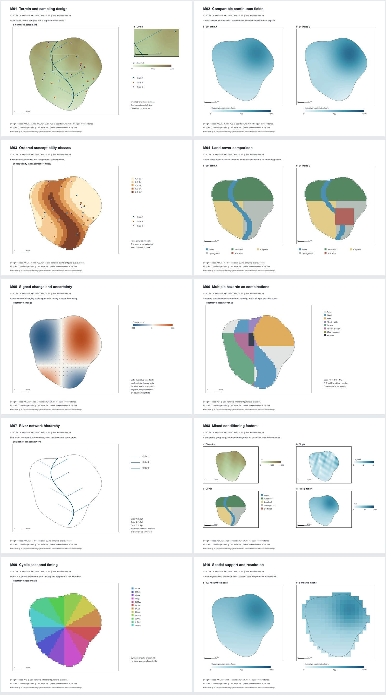

# ArcGIS Desktop Cartography Skills

面向 ArcMap / ArcGIS Desktop 的科研制图技能：坐标检查、DEM 渲染、期刊地图设计、原生工程导出与故障恢复。

本次整理阅读了 **30 篇期刊论文的相关方法、图注与选定图件**，形成可追溯的学习记录，并把设计归纳为 **10 类原生合成数据复刻**。每条记录包含 DOI、图号、软件证据、设计观察、改进方法与适用边界。28 篇有直接 ArcGIS 软件说明，2 篇仅有混合软件或配套资源证据，已分别标注。不是逐一复现 30 张原图，也不复现论文的科学结论。

## 从这里开始

- [技能入口](arcgis-desktop-cartography/SKILL.md)
- [30 篇逐图学习记录](arcgis-desktop-cartography/references/literature-30.md) · [JSON](arcgis-desktop-cartography/references/literature-30.json) · [BibTeX](arcgis-desktop-cartography/references/literature-30.bib)
- [10 类地图配方](arcgis-desktop-cartography/references/journal-map-recipes.md)
- [10 页原生导出图册 PDF](arcgis-desktop-cartography/assets/native-atlas.pdf)
- [运行与修改](arcgis-desktop-cartography/references/native-gallery.md) · [验证结果](arcgis-desktop-cartography/references/validation-report.md)



## 包含哪些图

|编号|设计|重点|
|---|---|---|
|M01|地形、采样与详情框|原生 DEM、河网、分组点形、独立比例尺|
|M02|连续场比较|固定色限、同范围、同单位|
|M03|有序易发性分级|固定数值断点、等级色序、样点叠加|
|M04|土地覆盖比较|两期共享类别与颜色字典|
|M05|变化与不确定性|零中心发散色、独立点纹语义|
|M06|多灾种组合|八种组合编码与完整图例|
|M07|河网层级|按等级映射线宽与颜色|
|M08|异质因子组图|同地理范围，不同单位各自图例|
|M09|循环月份|月份邻接关系与循环色序|
|M10|空间分辨率与支持|300 米格网、3 公里有效面积均值|

原生工程位于 `arcgis-desktop-cartography/assets/synthetic/maps/M01` 至 `M10`，包括 **10 个 MXD、17 个数据框、41 个 LYR、10 个 PDF 和 10 个 PNG**。整个 `synthetic/` 目录一起移动，才能保留数据依赖。所有地形、点、河网与数值都是可重建的合成数据。

## 使用与验证

2026-10-02 发布复核：技能目录的 167 个文件与本机最新整理版一致；12 项离线测试及技能结构检查通过。本次增加 Git 字节保留规则，避免 Windows 自动转换换行符导致发布哈希不匹配。原生 ArcMap 重开、迁移与渲染结果沿用 2026-09-30 的验证记录，本次没有重新运行原生制图。

将整个 `arcgis-desktop-cartography/` 文件夹复制到自己的技能目录，保留目录结构；也可以只按文档独立使用。需要原生编辑时，使用自己已有且获授权的 ArcGIS Desktop 安装。

- 原生地图生成与重开检查：32 位 ArcMap Python 2.7、ArcPy、ArcObjects，以及自行准备的任务本地 `comtypes==1.1.7`。本包不分发 ArcGIS、许可证或第三方 COM 库。
- 数据生成及离线测试：Python 3、NumPy、rasterio、pyshp。安装路径通过参数传入。
- ArcGIS Pro 的 Python 3 / `arcpy.mp` 不是这套脚本的运行环境。文献中的 Pro 图件只提供设计参考。

进入 `arcgis-desktop-cartography/` 后运行：

```powershell
& '<python3.exe>' -B -m unittest discover -s scripts -p 'test_*.py'
```

完整生成命令和迁移复查步骤见 [native-gallery.md](arcgis-desktop-cartography/references/native-gallery.md)。已有图例和比例尺是可编辑图形；修改地图范围、数据或符号后，需要重新生成并核对。

## 数据、隐私与许可

文档与脚本使用 [MIT](LICENSE)。原创合成数据按 CC0-1.0 提供，原生示例与预览按 MIT 提供，详见 [内容与许可边界](THIRD_PARTY_NOTICES.md)。论文作者、题名与 DOI 保留学术署名，论文原图、全文缓存与真实研究数据不随包分发。

本包已移除本机个人目录；原生二进制经中性目录构建和迁移检查。未纳入服务器连接配置、账号密钥或私有研究数据。隐私检查范围与运行限制见 [验证报告](arcgis-desktop-cartography/references/validation-report.md)。

相关项目：[Origin Meteohydro Skills](https://github.com/ARETE-zzwl/origin-meteohydro-skills)。
